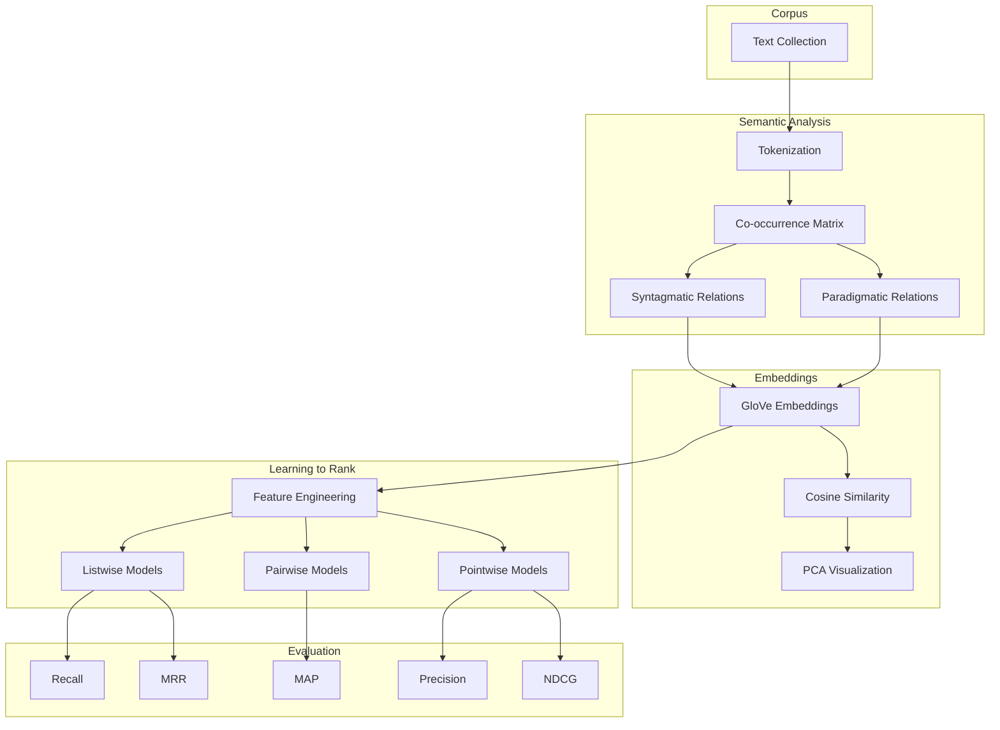
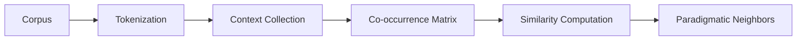
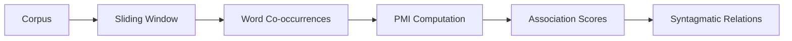
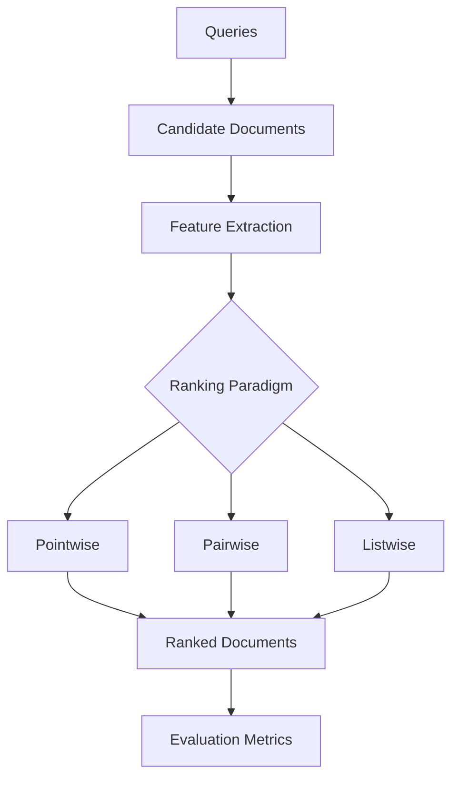

<div align="center">

</div>

---

# Advanced Information Retrieval with Distributional Semantics, Word Embeddings, and Learning-to-Rank

This project presents a comprehensive implementation of modern **Information Retrieval (IR)** techniques by integrating **distributional semantics**, **word embedding analysis**, and **Learning-to-Rank (LTR)** algorithms into a unified experimental framework. It investigates semantic word relationships through paradigmatic and syntagmatic analysis, explores pre-trained **GloVe** embeddings, and evaluates multiple ranking paradigms—including **Pointwise**, **Pairwise**, and **Listwise** approaches—on the Cranfield benchmark.

<div align="left">

[](https://www.python.org/)
[](https://scikit-learn.org/)
[](https://numpy.org/)
[](https://pandas.pydata.org/)
[](https://matplotlib.org/)
[](https://www.nltk.org/)
[](https://nlp.stanford.edu/projects/glove/)
[](#)
[](#)
[](#)
[](#)
[](https://opensource.org/licenses/MIT)

</div>

---

## Abstract

Information Retrieval systems rely heavily on effective document representation, semantic understanding, and ranking mechanisms to retrieve relevant information efficiently. This project provides an end-to-end exploration of modern Information Retrieval by combining **distributional semantics**, **semantic word embeddings**, and **Learning-to-Rank (LTR)** methodologies.

The project investigates lexical semantics through **Paradigmatic** and **Syntagmatic** word association analysis, analyzes semantic representations learned by **pre-trained GloVe embeddings** using PCA visualizations, and evaluates **Pointwise**, **Pairwise**, and **Listwise** ranking algorithms on the **Cranfield benchmark**. 

---

## Table of Contents

1. [Overview](#-overview)
2. [System Pipeline](#-system-pipeline)
3. [Distributional Semantics](#-distributional-semantics)
4. [Word Embeddings](#-word-embeddings)
5. [Learning-to-Rank Framework](#-learning-to-rank-framework)
6. [Experimental Results](#-experimental-results)
7. [Visualizations](#-visualizations)
8. [Project Structure](#-project-structure)
9. [Installation](#-installation)
10. [License & Author](#license)

---

# 📌 Overview

This project builds a comprehensive Information Retrieval experimentation framework by bridging traditional NLP techniques with machine learning-based ranking algorithms. Rather than focusing on a single retrieval model, it explores how semantic knowledge can be extracted from corpora (co-occurrence statistics and PMI), represented using dense embeddings (GloVe), and ultimately utilized in supervised ranking models (Pointwise, Pairwise, Listwise) for optimal document retrieval.

---

# ⚙️ System Pipeline

The project follows a multi-stage Information Retrieval pipeline that progressively transforms raw textual information into semantically meaningful representations before applying supervised ranking algorithms.



### Architectural Components

| Layer | Responsibility |
|------------|------------------------------|
| **Corpus** | Raw textual collection (Cranfield benchmark) |
| **Semantic Layer** | Distributional semantics, Paradigmatic & Syntagmatic relations |
| **Embedding Layer** | Dense semantic representation using GloVe and PCA |
| **Ranking Layer** | Supervised Learning-to-Rank algorithms |
| **Evaluation Layer** | Retrieval performance analysis using standard metrics |

---

# 📖 Distributional Semantics

Distributional Semantics is founded on the linguistic hypothesis that words appearing in similar contexts tend to share similar meanings. This project investigates two complementary forms of semantic relationships:

## 🔹 Paradigmatic Relations
Captures semantic similarity between words that can substitute for one another in similar contexts (e.g., *system* vs. *framework*).



## 🔹 Syntagmatic Relations
Describes words that frequently occur together within local contexts, exhibiting strong contextual dependency (e.g., *computer* + *software*).



---

# 🧠 Word Embeddings

Traditional sparse representations often fail to capture deeper semantic relationships among words. This project utilizes **pre-trained GloVe embeddings** to encode semantic information into dense continuous vector spaces, enabling:

- **Semantic Neighborhood Retrieval:** Identifying semantically related words (like technology-related words clustering around *computer*) using cosine similarity.
- **Embedding Space Visualization:** Projecting high-dimensional vectors into 2D spaces using **PCA** for visual inspection of clustering behavior and embedding geometry.

---

# 📈 Learning-to-Rank Framework

Instead of simply classifying documents as relevant or non-relevant, Learning-to-Rank models learn an ordering function that prioritizes highly relevant documents.

### Ranking Paradigms Implemented:
1. **Pointwise:** Formulates ranking as standard regression or classification. Evaluates each document independently (e.g., Random Forest, Gradient Boosting).
2. **Pairwise:** Transforms ranking into a binary preference problem, learning which document in a pair should be ranked higher (e.g., RankNet, RankSVM).
3. **Listwise:** Directly optimizes entire ranked lists and evaluation metrics such as NDCG (e.g., LambdaMART, ListNet).

### Ranking Pipeline



*(Note: The performance of all ranking models is comprehensively evaluated on the Cranfield dataset using standard IR metrics including **NDCG@k**, **MAP**, **MRR**, **Precision@k**, and **Recall@k**.)*

---

# 📊 Experimental Results & Visualizations

Overall experimental results indicate that **Listwise** ranking algorithms provide the highest retrieval effectiveness, while **Pairwise** methods offer competitive performance with lower computational complexity. Furthermore, **GloVe** embeddings successfully capture meaningful semantic neighborhoods, verified by PCA projections.

### Visual Analysis
*(Visualizations are available in the `assets/images/` directory)*
- **Paradigmatic vs Syntagmatic Relations:** Compares similarity-based vs. contextual co-occurrence relationships.
- **PCA Visualizations:** Demonstrates semantic neighborhoods in low-dimensional space.
- **LTR Comparison & Heatmap:** Summarizes retrieval performance across all ranking models and metrics.

---

# 📁 Project Structure

```text
Information-Retrieval-with-Learning-to-Rank-and-Distributional-Semantics
│
├── IIR-CA4-810103099.ipynb
│
├── datasets/
│   ├── cran.all.1400
│   ├── cran.qry
│   ├── cranqrel
│   └── cranqrel.readme
│
├── assets/
│   └── images/
│       ├── embedding_pca.png
│       ├── paradigmatic_pca_visualization.png
│       ├── paradigmatic_vs_syntagmatic_comparison.png
│       ├── ltr_comparison.png
│       └── ltr_heatmap.png
│
├── outputs/
│   ├── embedding_similarities.csv
│   └── ltr_results.csv
│
├── requirements.txt
└── README.md
```

---

# 🚀 Installation

## Clone Repository
```bash
git clone https://github.com/farzadjannati/Information-Retrieval-with-Learning-to-Rank-and-Distributional-Semantics.git
cd Information-Retrieval-with-Learning-to-Rank-and-Distributional-Semantics
```

## Create Environment & Run
```bash
conda create -n information_retrieval python=3.10
conda activate information_retrieval
pip install -r requirements.txt
jupyter notebook IIR-CA4-810103099.ipynb
```

---

# License

This project is licensed under the MIT License.

---

## Author

**Farzad Jannati**

M.Sc. Student, University of Tehran  
Research Assistant @ Social Networks Lab

**Research Interests:** Information Retrieval, NLP, Learning-to-Rank, LLMs, RAG, Agentic AI

📧 [farzadjannati@ut.ac.ir](mailto:farzadjannati@ut.ac.ir) | 💻 [github.com/farzadjannati](https://github.com/farzadjannati) | 💼 [linkedin.com/in/farzadjannati](https://www.linkedin.com/in/farzadjannati)

---

# ⭐ Support

If you find this repository useful, consider giving it a ⭐ on GitHub. Contributions and discussions are always welcome.

<p align="center">
Built with ❤️ using Python, Scikit-Learn, GloVe, NLTK, and Learning-to-Rank
</p>
