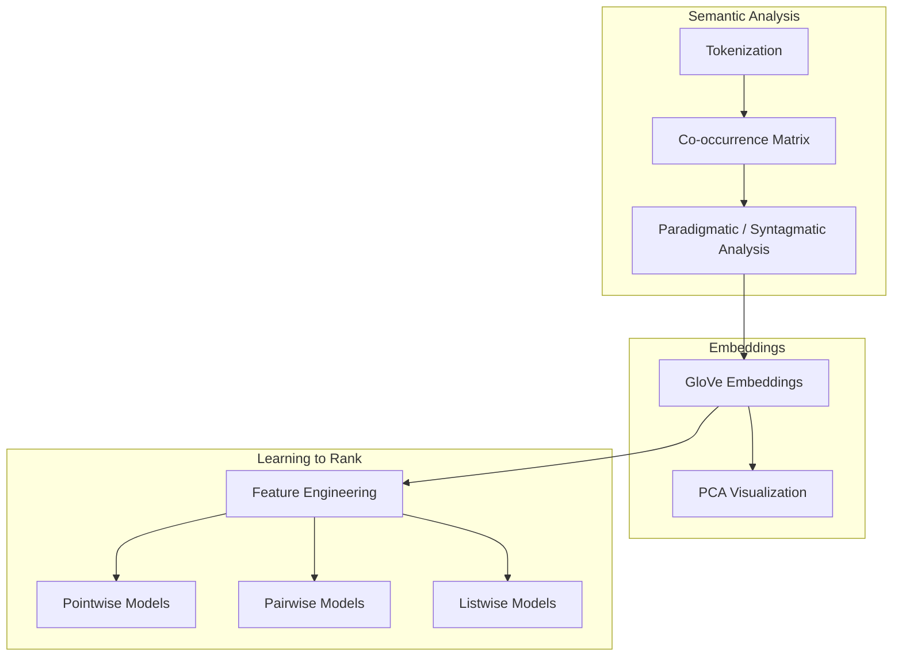

<div align="center">

</div>

---

# Advanced Information Retrieval with Distributional Semantics, Word Embeddings, and Learning-to-Rank

This project presents a comprehensive implementation of modern **Information Retrieval (IR)** techniques by integrating **distributional semantics**, **word embedding analysis**, and **Learning-to-Rank (LTR)** algorithms into a unified experimental framework. It investigates semantic word relationships through paradigmatic and syntagmatic analysis, explores pre-trained **GloVe** embeddings, and evaluates multiple ranking paradigms—including **Pointwise**, **Pairwise**, and **Listwise** approaches—on the Cranfield benchmark.

<div align="left">
[](https://www.python.org/)
[](https://scikit-learn.org/)
[](https://numpy.org/)
[](https://pandas.pydata.org/)
[](https://matplotlib.org/)
[](https://nlp.stanford.edu/projects/glove/)
[](https://opensource.org/licenses/MIT)
</div>

---

## Abstract

Information Retrieval systems rely heavily on effective document representation, semantic understanding, and ranking mechanisms to retrieve relevant information efficiently. This project provides an end-to-end exploration of modern Information Retrieval by combining **distributional semantics**, **semantic word embeddings**, and **Learning-to-Rank (LTR)** methodologies.

The project investigates lexical semantics through **Paradigmatic** and **Syntagmatic** analysis, explores **GloVe** embedding representations via PCA, and implements/compares **Pointwise**, **Pairwise**, and **Listwise** ranking algorithms on the **Cranfield benchmark**, evaluating retrieval effectiveness using standard metrics like **NDCG**, **MAP**, and **MRR**.

---

## Table of Contents

1. [Overview](#-overview)
2. [System Pipeline](#-system-pipeline)
3. [Distributional Semantics](#-distributional-semantics)
4. [Word Embeddings](#-word-embeddings)
5. [Learning-to-Rank Framework](#-learning-to-rank-framework)
6. [Project Structure](#-project-structure)
7. [Installation](#-installation)
8. [License](#license)
9. [Author](#author)
10. [Support](#-support)

---

# 📌 Overview

This project explores how semantic knowledge can be extracted from corpora, represented using dense embeddings, and ultimately utilized in supervised ranking models for document retrieval. 

Rather than focusing on a single retrieval model, the implementation combines traditional NLP techniques with machine learning-based ranking algorithms to build a comprehensive Information Retrieval experimentation framework, bridging the gap between lexical semantic analysis and modern ranking paradigms.

---

# ⚙️ System Pipeline

The project follows a multi-stage Information Retrieval pipeline that progressively transforms raw textual information into semantically meaningful representations before applying supervised ranking algorithms.



---

# 📖 Distributional Semantics

Distributional Semantics is founded on the linguistic hypothesis that words appearing in similar contexts share similar meanings. This project investigates two complementary forms of semantic relationships:

- **Paradigmatic Relations:** Captures similarity-based relationships and context-independent substitutions (e.g., *system* vs. *framework*).
- **Syntagmatic Relations:** Captures contextual co-occurrence, dependencies, and collocations (e.g., *computer* + *software*).

---

# 🧠 Word Embeddings

To address the limitations of traditional sparse representations, the project utilizes **pre-trained GloVe embeddings**, encoding semantic information into dense vector spaces. These embeddings enable:

- **Semantic Neighborhood Retrieval:** Identifying semantically related words via cosine similarity.
- **PCA Visualization:** Projecting high-dimensional embeddings into 2D spaces to inspect semantic clusters and geometric relationships.

---

# 📈 Learning-to-Rank Framework

Instead of simple relevance classification, Learning-to-Rank models learn an ordering function to prioritize highly relevant documents. This project implements and compares three major ranking paradigms:

| Paradigm | Description |
|----------|-------------|
| **Pointwise** | Treats ranking as regression/classification of individual documents independently. |
| **Pairwise** | Transforms ranking into a binary preference problem to predict relative document ordering. |
| **Listwise** | Optimizes the entire ranked list directly for ranking metrics such as NDCG. |

---

# 📁 Project Structure

```text
Information-Retrieval-with-Learning-to-Rank-and-Distributional-Semantics
│
├── IIR-CA4-810103099.ipynb
│
├── datasets/
│   ├── cran.all.1400
│   ├── cran.qry
│   ├── cranqrel
│   └── cranqrel.readme
│
├── assets/
│   └── images/
│       ├── embedding_pca.png
│       ├── paradigmatic_pca_visualization.png
│       └── ltr_comparison.png
│
├── outputs/
│   ├── embedding_similarities.csv
│   └── ltr_results.csv
│
├── requirements.txt
└── README.md
```

---

# 🚀 Installation

## Clone Repository

```bash
git clone https://github.com/farzadjannati/Information-Retrieval-with-Learning-to-Rank-and-Distributional-Semantics.git
cd Information-Retrieval-with-Learning-to-Rank-and-Distributional-Semantics
```

## Setup Environment

```bash
conda create -n information_retrieval python=3.10
conda activate information_retrieval
pip install -r requirements.txt
```

## Run the Project

Launch Jupyter and execute the main notebook:
```bash
jupyter notebook IIR-CA4-810103099.ipynb
```

---

# License

This project is licensed under the MIT License.

---

## Author

**Farzad Jannati**

M.Sc. Student, University of Tehran 

Research Assistant @ Social Networks Lab

**Research Interests:** Information Retrieval, NLP, Learning-to-Rank, LLMs, RAG, Agentic AI

📧 [farzadjannati@ut.ac.ir](mailto:farzadjannati@ut.ac.ir) | 💻 [github.com/farzadjannati](https://github.com/farzadjannati) | 💼 [linkedin.com/in/farzadjannati](https://www.linkedin.com/in/farzadjannati)

---

# ⭐ Support

If you find this repository useful for your research or learning, consider giving it a ⭐ on GitHub!

<p align="center">
Built with ❤️ using Python, Scikit-Learn, GloVe, NLTK, and Learning-to-Rank
</p>
