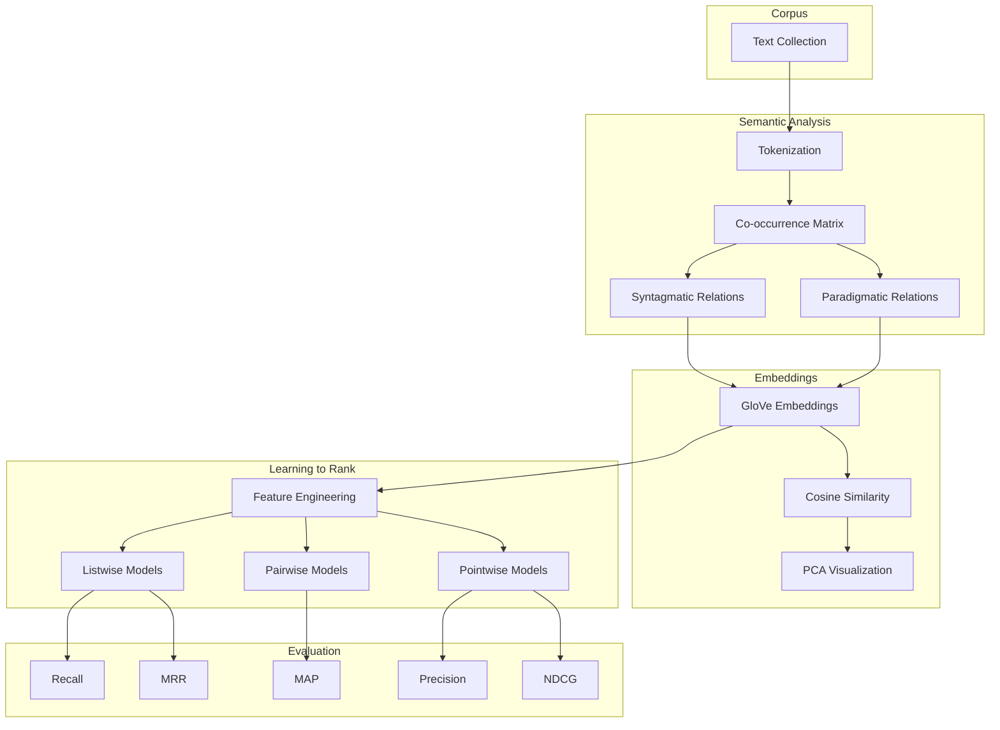
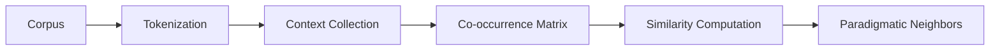
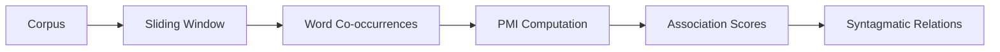
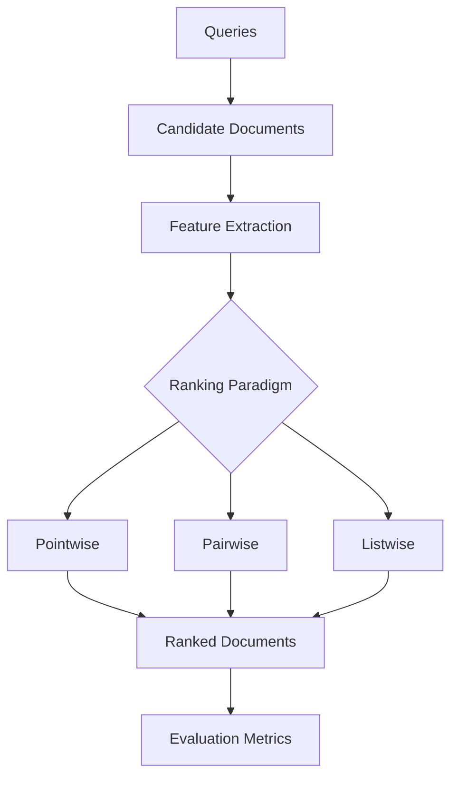

<div align="center">


</div>

---

# Advanced Information Retrieval with Distributional Semantics, Word Embeddings, and Learning-to-Rank

This project presents a comprehensive implementation of modern **Information Retrieval (IR)** techniques by integrating **distributional semantics**, **word embedding analysis**, and **Learning-to-Rank (LTR)** algorithms into a unified experimental framework. It investigates semantic word relationships through paradigmatic and syntagmatic analysis, explores pre-trained **GloVe** embeddings, and evaluates multiple ranking paradigms—including **Pointwise**, **Pairwise**, and **Listwise** approaches—on the Cranfield benchmark using standard Information Retrieval evaluation metrics.

<div align="left">

[](https://www.python.org/)
[](https://scikit-learn.org/)
[](https://numpy.org/)
[](https://pandas.pydata.org/)
[](https://matplotlib.org/)
[](https://www.nltk.org/)
[](https://nlp.stanford.edu/projects/glove/)
[](#)
[](#)
[](#)
[](#)
[](https://opensource.org/licenses/MIT)

</div>

---

# Abstract

Information Retrieval systems rely heavily on effective document representation, semantic understanding, and ranking mechanisms to retrieve relevant information efficiently. This project provides an end-to-end exploration of modern Information Retrieval by combining **distributional semantics**, **semantic word embeddings**, and **Learning-to-Rank (LTR)** methodologies.

The first part investigates lexical semantics through **Paradigmatic** and **Syntagmatic** word association analysis, demonstrating how semantic similarity and contextual co-occurrence capture complementary linguistic relationships.

The second part analyzes semantic representations learned by **pre-trained GloVe embeddings**, exploring nearest-neighbor structures and low-dimensional semantic visualizations using PCA.

Finally, the project implements and compares **Pointwise**, **Pairwise**, and **Listwise** ranking algorithms on the **Cranfield Information Retrieval benchmark**, evaluating retrieval effectiveness using standard metrics including **NDCG**, **MAP**, **MRR**, **Precision**, and **Recall**.

Overall, this project demonstrates the complete Information Retrieval pipeline—from lexical semantics and embedding-based representation learning to supervised document ranking and experimental evaluation.

---

# Table of Contents

1. [Overview](#-overview)
2. [Project Objectives](#-project-objectives)
3. [Key Features](#-key-features)
4. [System Pipeline](#-system-pipeline)
5. [Distributional Semantics](#-distributional-semantics)
6. [Word Embeddings](#-word-embeddings)
7. [Learning-to-Rank Framework](#-learning-to-rank-framework)
8. [Experimental Evaluation](#-experimental-evaluation)
9. [Visualizations](#-visualizations)
10. [Dataset](#-dataset)
11. [Project Structure](#-project-structure)
12. [Installation](#-installation)
13. [Requirements](#-requirements)
14. [License](#license)
15. [Author](#author)
16. [Support](#-support)

---

# 📌 Overview

This project covers three major research directions in modern Information Retrieval:

- Distributional Semantics
- Semantic Word Embeddings
- Learning-to-Rank

Rather than focusing on a single retrieval model, the project explores how semantic knowledge can be extracted from corpora, represented using dense embeddings, and ultimately utilized in supervised ranking models for document retrieval.

The implementation combines traditional NLP techniques with machine learning-based ranking algorithms to build a comprehensive Information Retrieval experimentation framework.

---

# 🎯 Project Objectives

The primary objectives of this project include:

- Investigating semantic relationships between words
- Comparing paradigmatic and syntagmatic word associations
- Exploring semantic neighborhoods using GloVe embeddings
- Visualizing embedding spaces using PCA
- Building Learning-to-Rank models
- Comparing Pointwise, Pairwise, and Listwise ranking paradigms
- Evaluating retrieval performance using standard IR metrics
- Providing extensive visual analysis of ranking performance

---

# 🚀 Key Features

### Distributional Semantics

- Paradigmatic relation extraction
- Syntagmatic relation analysis
- Co-occurrence statistics
- PMI-based semantic analysis

### Word Embeddings

- Pre-trained GloVe vectors
- Semantic nearest-neighbor retrieval
- Cosine similarity analysis
- PCA visualization
- Embedding space exploration

### Learning to Rank

- Pointwise ranking models
- Pairwise ranking models
- Listwise ranking models
- Cranfield benchmark evaluation
- Multi-metric performance comparison

### Visualization

- PCA plots
- Semantic neighborhood visualization
- Learning-to-Rank comparison charts
- Heatmaps
- Performance analysis figures

---

# System Pipeline

The project follows a multi-stage Information Retrieval pipeline that progressively transforms raw textual information into semantically meaningful representations before applying supervised ranking algorithms for document retrieval.



---

### Architectural Components

| Layer | Responsibility |
|------------|------------------------------|
| Corpus | Raw textual collection |
| Semantic Layer | Distributional semantics |
| Embedding Layer | Dense semantic representation |
| Ranking Layer | Learning-to-Rank algorithms |
| Evaluation Layer | Retrieval performance analysis |

The modular architecture enables independent evaluation of semantic representation learning and supervised ranking techniques while maintaining a unified Information Retrieval pipeline.

---

# 📖 Distributional Semantics

Distributional Semantics is founded on the linguistic hypothesis that words appearing in similar contexts tend to share similar meanings. Instead of relying on manually curated lexical resources, semantic relationships are inferred directly from corpus statistics through contextual co-occurrence patterns.

This project investigates two complementary forms of semantic relationships:

- **Paradigmatic Relations** (similarity-based)
- **Syntagmatic Relations** (contextual association)

Together, these analyses provide insights into how semantic information is encoded in natural language before applying dense vector representations and supervised ranking algorithms.

---

# 🔹 Paradigmatic Relations

Paradigmatic relations capture semantic similarity between words that can substitute for one another in similar contexts. These relationships are primarily derived from distributional similarity and represent words belonging to similar semantic categories.

Examples include:

| Target Word | Paradigmatic Neighbors |
|-------------|-----------------------|
| computer | system, software, information |
| government | state, law, authority |
| science | research, knowledge, discovery |
| people | humans, individuals, society |
| system | framework, architecture, platform |

The implementation computes semantic similarity using contextual statistics and cosine similarity over vector representations.

### Characteristics

- Semantic similarity
- Taxonomic relationships
- Synonym-like behavior
- Context-independent substitutions

---

### Paradigmatic Analysis Workflow



---

# 🔹 Syntagmatic Relations

Unlike paradigmatic relations, syntagmatic relations describe words that frequently occur together within local contexts.

Rather than being semantically interchangeable, these words exhibit strong contextual dependency.

Examples include:

| Target Word | Syntagmatic Associations |
|-------------|-------------------------|
| computer | software, hardware, technology |
| government | policy, public, law |
| science | research, university, technology |
| people | society, world, community |
| system | software, data, users |

These associations are extracted using co-occurrence statistics and Pointwise Mutual Information (PMI).

### Characteristics

- Contextual dependency
- Frequent co-occurrence
- Collocations
- Phrase-level semantics

---

### Syntagmatic Analysis Workflow



---

# 🧠 Word Embeddings

Traditional sparse representations often fail to capture deeper semantic relationships among words.

To address this limitation, the project utilizes **pre-trained GloVe embeddings**, which encode semantic information into dense continuous vector spaces.

These embeddings enable:

- Semantic similarity computation
- Analogical reasoning
- Nearest-neighbor retrieval
- Low-dimensional visualization
- Context-aware semantic analysis

---

## GloVe Embedding Analysis

The project investigates semantic neighborhoods for multiple representative query words, including:

- computer
- government
- science
- people
- system

For each query term, cosine similarity is computed to retrieve semantically related words within the embedding space.

The resulting neighborhoods illustrate how semantic representations learned from large corpora naturally organize related concepts.

---

### Semantic Neighborhood Retrieval

The nearest-neighbor search is performed using cosine similarity over normalized embedding vectors.

The analysis demonstrates that words sharing semantic properties cluster together in high-dimensional space despite never being explicitly labeled.

Key observations include:

- Technology-related words cluster around **computer**
- Political concepts surround **government**
- Academic terminology groups near **science**
- Human-centered concepts organize around **people**
- Infrastructure terminology clusters around **system**

---

### Embedding Space Visualization

To improve interpretability, the high-dimensional embedding vectors are projected into two dimensions using **Principal Component Analysis (PCA)**.

The visualization highlights semantic clusters while preserving the relative geometry of neighboring words.

Benefits include:

- Understanding semantic neighborhoods
- Visual inspection of clustering behavior
- Comparing multiple target words
- Exploring embedding geometry

---

# 📈 Learning-to-Rank Framework

Ranking is the central component of modern Information Retrieval systems.

Instead of simply classifying documents as relevant or non-relevant, Learning-to-Rank models learn an ordering function that prioritizes highly relevant documents for each query.

This project investigates three major ranking paradigms.

---

## Pointwise Learning-to-Rank

Pointwise methods formulate ranking as either:

- Regression
- Classification

Each document is evaluated independently using handcrafted features.

Implemented models include:

- Linear Regression
- Random Forest
- Gradient Boosting
- Neural Networks

### Advantages

- Simple training
- Fast inference
- Easy optimization

### Limitations

- Ignores relative ordering between documents

---

## Pairwise Learning-to-Rank

Pairwise approaches transform ranking into a binary preference problem.

Rather than predicting absolute relevance scores, the model learns which document should be ranked higher.

Implemented models include:

- RankNet
- RankSVM
- Pairwise Neural Network

Advantages include:

- Direct optimization of ranking quality
- Better relative ordering
- Strong performance on retrieval benchmarks

---

## Listwise Learning-to-Rank

Listwise algorithms optimize entire ranked lists rather than individual documents or document pairs.

These methods directly optimize ranking metrics such as NDCG.

Implemented algorithms include:

- LambdaMART
- ListNet
- AdaRank

Advantages include:

- State-of-the-art ranking quality
- Metric-aware optimization
- Better retrieval effectiveness

---

# Ranking Pipeline



---

# 📊 Evaluation Metrics

The performance of each Learning-to-Rank model is evaluated using widely adopted Information Retrieval metrics.

| Metric | Purpose |
|----------|---------------------------|
| Precision@k | Retrieval accuracy |
| Recall@k | Relevant document coverage |
| NDCG@k | Ranking quality |
| MAP | Average precision |
| MRR | First relevant document ranking |

---

## Metrics Explained

### NDCG

Measures ranking quality while assigning greater importance to highly ranked relevant documents.

---

### MAP

Evaluates average precision across multiple queries.

---

### MRR

Measures how early the first relevant document appears in the ranked list.

---

### Precision

Quantifies the proportion of retrieved documents that are relevant.

---

### Recall

Measures the proportion of relevant documents successfully retrieved.

---

Collectively, these metrics provide a comprehensive evaluation of ranking effectiveness from multiple perspectives, enabling fair comparison between Pointwise, Pairwise, and Listwise Learning-to-Rank algorithms.

---

# 📊 Experimental Results

The experimental evaluation demonstrates the effectiveness of semantic representation learning and Learning-to-Rank algorithms across multiple Information Retrieval tasks.

The project compares classical machine learning models with modern ranking algorithms under a unified evaluation protocol using the Cranfield benchmark.

Major observations include:

- Pairwise and Listwise ranking models consistently outperform Pointwise approaches.
- Listwise methods achieve the strongest overall ranking performance across most evaluation metrics.
- GloVe embeddings successfully capture meaningful semantic neighborhoods.
- Paradigmatic and syntagmatic analyses reveal complementary lexical relationships.
- PCA projections preserve semantic clustering in low-dimensional space.

---

# 📈 Performance Comparison

The Learning-to-Rank models are evaluated using:

- NDCG@5
- NDCG@10
- NDCG@20
- Precision@5
- Precision@10
- Precision@20
- Recall@5
- Recall@10
- Recall@20
- MAP
- MRR

Overall experimental results indicate that Listwise ranking algorithms provide the highest retrieval effectiveness, while Pairwise methods offer competitive performance with lower computational complexity.

---

# 🖼️ Visualizations

The repository contains several visualization modules for analyzing semantic representations and ranking performance.

## Distributional Semantics

### Paradigmatic vs Syntagmatic Relations

<p align="center">


</p>

This visualization compares similarity-based semantic relationships (Paradigmatic) against contextual co-occurrence relationships (Syntagmatic), illustrating how both perspectives contribute to lexical semantics.

---

## Paradigmatic Semantic Space

<p align="center">


</p>

The PCA projection visualizes semantic neighborhoods generated from paradigmatic word associations.

---

## GloVe Embedding Visualization

<p align="center">


</p>

Low-dimensional PCA projections of pre-trained GloVe embeddings reveal meaningful semantic clusters around representative query words.

---

## Learning-to-Rank Performance Comparison

<p align="center">


</p>

Comparison of Pointwise, Pairwise, and Listwise ranking models across multiple Information Retrieval metrics.

---

## Learning-to-Rank Heatmap

<p align="center">


</p>

Heatmap summarizing retrieval performance across all ranking models and evaluation metrics.

---

# 📚 Dataset

The project utilizes the **Cranfield Information Retrieval benchmark**, one of the most widely used datasets for evaluating document retrieval systems.

The dataset consists of:

- Document Collection
- Query Set
- Relevance Judgments (Qrels)

Files included:

```
cran.all.1400
cran.qry
cranqrel
cranqrel.readme
```

The benchmark enables standardized comparison between different Learning-to-Rank algorithms.

---

# 📁 Project Structure

```text
Information-Retrieval-with-Learning-to-Rank-and-Distributional-Semantics
│
├── IIR-CA4-810103099.ipynb
│
├── datasets/
│   ├── cran.all.1400
│   ├── cran.qry
│   ├── cranqrel
│   └── cranqrel.readme
│
├── assets/
│   └── images/
│       ├── embedding_pca.png
│       ├── paradigmatic_pca_visualization.png
│       ├── paradigmatic_vs_syntagmatic_comparison.png
│       ├── ltr_comparison.png
│       └── ltr_heatmap.png
│
├── outputs/
│   ├── embedding_similarities.csv
│   └── ltr_results.csv
│
├── requirements.txt
│
└── README.md
```

---

# 🚀 Installation

## Clone Repository

```bash
git clone https://github.com/farzadjannati/Information-Retrieval-with-Learning-to-Rank-and-Distributional-Semantics.git

cd Information-Retrieval-with-Learning-to-Rank-and-Distributional-Semantics
```

---

## Create Environment

```bash
conda create -n information_retrieval python=3.10

conda activate information_retrieval
```

---

## Install Dependencies

```bash
pip install -r requirements.txt
```

---

# ▶️ Running the Project

Launch the notebook:

```bash
jupyter notebook
```

or

```bash
jupyter lab
```

Then execute:

```
IIR-CA4-810103099.ipynb
```

The notebook contains all experiments, visualizations, semantic analyses, and Learning-to-Rank evaluations.

---

# ⚙️ Requirements

Main libraries used in this project include:

- Python 3.10+
- NumPy
- Pandas
- Scikit-learn
- Matplotlib
- NLTK
- Gensim
- SciPy

Example:

```text
numpy
pandas
scikit-learn
matplotlib
nltk
gensim
scipy
```

---

# 🔬 Future Improvements

Potential future extensions include:

- Transformer-based dense retrieval
- BM25 + Neural Re-ranking
- BERT embeddings
- Sentence Transformers
- Cross-Encoder ranking
- ColBERT retrieval
- Learning-to-Rank with XGBoost
- LambdaLoss optimization
- Neural Information Retrieval
- Large Language Model-assisted retrieval

---

# 📝 Citation

If you find this repository useful for your research, please consider citing it.

```bibtex
@misc{informationretrieval2025,
  title={Advanced Information Retrieval with Distributional Semantics, Word Embeddings, and Learning-to-Rank},
  author={Farzad Jannati},
  year={2025},
  publisher={GitHub}
}
```

---

# License

This project is licensed under the MIT License.

---

# Author

**Farzad Jannati**

M.Sc. Student, University of Tehran

Research Assistant @ Social Networks Lab

**Research Interests**

- Information Retrieval
- Natural Language Processing
- Learning-to-Rank
- Large Language Models (LLMs)
- Retrieval-Augmented Generation (RAG)
- Agentic AI

📧 farzadjannati@ut.ac.ir

💻 https://github.com/farzadjannati

💼 https://www.linkedin.com/in/farzadjannati

---

# ⭐ Support

If you find this repository useful, consider giving it a ⭐ on GitHub.

Contributions, suggestions, and discussions are always welcome.

---

<p align="center">

Built with ❤️ using Python, Scikit-Learn, GloVe, NLTK, and Learning-to-Rank

</p>
